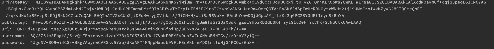
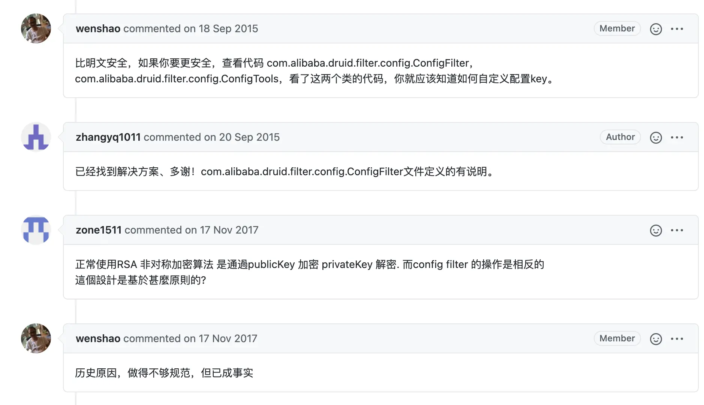
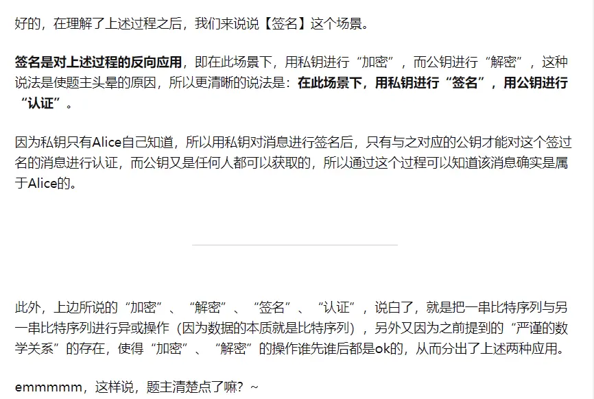

# 数据库加密 · dynamic-datasource · 看云

+ [基础介绍](https://www.kancloud.cn/tracy5546/dynamic-datasource/2280963#_2)
+ [具体使用](https://www.kancloud.cn/tracy5546/dynamic-datasource/2280963#_15)
    - [1. 获得加密字符串。](https://www.kancloud.cn/tracy5546/dynamic-datasource/2280963#1__17)
    - [2. 配置加密yml。](https://www.kancloud.cn/tracy5546/dynamic-datasource/2280963#2_yml_45)
+ [自定义解密](https://www.kancloud.cn/tracy5546/dynamic-datasource/2280963#_63)
+ [为什么不是公钥加密，私钥解密？](https://www.kancloud.cn/tracy5546/dynamic-datasource/2280963#_87)

## 基础介绍
在一些项目中，有对数据库关键字段加密的需求，大家熟悉的是Druid的加密方式。

在连接池集成中的Druid章节里有对应的加密方式，但是如果我不用Druid也想用加密呢？

所以作者copy了Druid的加密相关源码，嘿嘿。

本项目也支持支持url , username, password 的加密。

使用的RAS加密，相关原理文章https://www.cnblogs.com/pcheng/p/9629621.html。  
简单来说就是生成两把钥匙，私钥加密，公钥解密。 公钥可以发布出去，解密也是用的公钥。

## 具体使用
## 1. 获得加密字符串。
```plain
import com.baomidou.dynamic.datasource.toolkit.CryptoUtils;

public class Demo {

    public static void main(String[] args) throws Exception {
        String password = "123456";
        //使用默认的publicKey ，建议还是使用下面的自定义
        String encodePassword = CryptoUtils.encrypt(password);
        System.out.println(encodePassword);
    }

        //自定义publicKey
    public static void main(String[] args) throws Exception {
        String[] arr = CryptoUtils.genKeyPair(512);
        System.out.println("privateKey:  " + arr[0]);
        System.out.println("publicKey:  " + arr[1]);
        System.out.println("url:  " + CryptoUtils.encrypt(arr[0], "jdbc:mysql://127.0.0.1:3306/order"));
        System.out.println("username:  " + CryptoUtils.encrypt(arr[0], "root"));
        System.out.println("password:  " + CryptoUtils.encrypt(arr[0], "123456"));
    }
}
```

复制



## 2. 配置加密yml。
ENC(xxx)` 中包裹的xxx即为使用加密方法后生成的字符串。

```plain
spring:
  datasource:
    dynamic:
      public-key: #有默认值，强烈建议更换
      datasource:
        master:
          url: ENC(xxxxx)
          username: ENC(xxxxx)
          password: ENC(xxxxx)
          driver-class-name: com.mysql.jdbc.Driver
          public-key: #每个数据源可以独立设置，没有就继承上面的。
```

复制

## 自定义解密
一些公司要求使用自己的方式加密，解密。从3.5.0版本开始，扩展了一个event。用户自行实现注入即可。

```plain
public interface DataSourceInitEvent {

    /**
     * 连接池创建前执行（可用于参数解密）
     *
     * @param dataSourceProperty 数据源基础信息
     */
    void beforeCreate(DataSourceProperty dataSourceProperty);

    /**
     * 连接池创建后执行
     *
     * @param dataSource 连接池
     */
    void afterCreate(DataSource dataSource);
}
```

复制

默认的实现是EncDataSourceInitEvent，即ENC方式的。

## 为什么不是公钥加密，私钥解密？
作者并不熟悉加密知识，为了兼容性copy的Druid的源码。 根据RSA的设计，大部分人会认为应该是公钥加密，私钥解密。 为什么Druid设计相反？

**建议更高的安全，可以把publicKey在启动时候传进去，或者配置中心配好，不让普通开发接触到就好。**

我们查询了Druid的ISSUE和一些文章。

1. Druid作者wenshao自己的回答。  
[https://github.com/alibaba/druid/issues/960](https://github.com/alibaba/druid/issues/960)  

2. 知乎一些文章片段。

  


> 来自: [数据库加密 · dynamic-datasource · 看云](https://www.kancloud.cn/tracy5546/dynamic-datasource/2280963)
>


> 更新: 2024-02-27 11:48:22  
> 原文: <https://www.yuque.com/janeyork/dynamic-datasource/sankz5wzzqyec0x7>