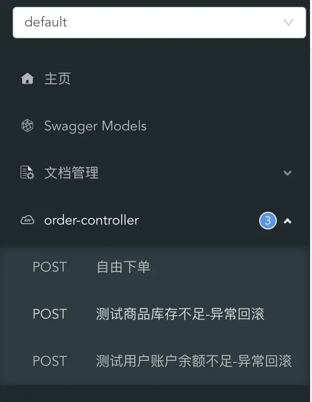

# 本地事务 · dynamic-datasource · 看云

+ [背景](https://www.kancloud.cn/tracy5546/dynamic-datasource/2268606#_2)
+ [基础介绍](https://www.kancloud.cn/tracy5546/dynamic-datasource/2268606#_13)
+ [注意事项](https://www.kancloud.cn/tracy5546/dynamic-datasource/2268606#_18)
+ [使用方法](https://www.kancloud.cn/tracy5546/dynamic-datasource/2268606#_28)
+ [示例项目](https://www.kancloud.cn/tracy5546/dynamic-datasource/2268606#_64)
+ [原理介绍](https://www.kancloud.cn/tracy5546/dynamic-datasource/2268606#_189)

## 背景
多数据源事务方案一直是一个难题，通常的解决方案有以下二种。

1. 利用atomiks手动构建多数据源事务，适合数据源较少，配置的参数也不太多,性能要求不高的项目。难点就是手动配置量大，需要耗费一定时间。
2. 用seata类似的分布式事务解决方案,难点就是需要搭建维护如seata-server的统一管理中心。

每一种方案都有其适用场景，本项目作者常常收到的问题就是。

1. 为什么我加了事务注解，切换数据源失败？
2. 我了解涉及了分布式事务了，但我不想用seata。我场景简单，有没有不依赖第三方的方案？

## 基础介绍
自从3.3.0开始，由seata的核心贡献者https://github.com/a364176773 贡献了基于connection代理的方案。  
建议从3.4.0版本开始使用，其修复了一个功能，老版本不加@DS只加@DSTransactional会报错。

## 注意事项
本地事务实现很简单，就是循环提交，发生错误，循环回滚。 我们默认的前提是数据库本身不会异常，比如宕机。  
如数据在回滚的过程突然宕机，本地事务就会有问题。如果你需要完整分布式方案请使用seata方案。

1. 不支持spring原生事务，不支持spring事务，不支持spring事务，可分别使用，**千万不能混用**。
2. 再次强调不支持spring事务注解，可理解成独立写了一套事务方案。
3. 只适合简单本地多数据源场景， 如果涉及异步和微服务等完整事务场景，请使用seata方案。
4. 暂时不支持更多配置，如只读，如spring的传播特性。 后续会根据反馈考虑支持。4.1.4会开始支持在类上使用.

## 使用方法
在最外层的方法添加 @DSTransactional，底下调用的各个类该切数据源就正常使用DS切换数据源即可。 就是这么简单。~

```plain
//如AService调用BService和CService的方法，A,B,C分别对应不同数据源。

public class AService {
    
    @DS("a")//如果a是默认数据源则不需要DS注解。
    @DSTransactional
    public void dosomething(){
        BService.dosomething();
        CService.dosomething();
    }
}

public class BService {
    
    @DS("b")
    public void dosomething(){
        //dosomething
    }
}

public class CService {
    
    @DS("c")
    public void dosomething(){
        //dosomething
    }
}
```

复制

只要@DSTransactional注解下任一环节发生异常，则全局多数据源事务回滚。  
如果BC上也有@DSTransactional会有影响吗？答：没有影响的。

## 示例项目
[https://github.com/dynamic-datasource/dynamic-datasource-samples/tree/master/tx-samples/tx-local-sample](https://github.com/dynamic-datasource/dynamic-datasource-samples/tree/master/tx-samples/tx-local-sample)

完整示例项目 数据库都已准备好，可以直接运行测试。[http://localhost:8080/doc.html](http://localhost:8080/doc.html)

示例项目A,B,C分别对应OrderService,ProductService，AccountService。分别是独立的数据库。

用户下单分别调用产品库扣库存，账户库扣余额。  
如果库存不足，或用户余额不足都抛出RuntimeException,触发整体回滚。

```plain
@Slf4j
@Service
@AllArgsConstructor
public class OrderService {

    private final OrderMapper orderMapper;
    private final AccountService accountService;
    private final ProductService productService;
    
    //@DS("order") 这里不需要，因为order是默认库，如果开启事务的不是默认库则必须加
    @DSTransactional //注意这里开启事务
    public void placeOrder(PlaceOrderRequest request) {
        log.info("=============ORDER START=================");
        Long userId = request.getUserId();
        Long productId = request.getProductId();
        Integer amount = request.getAmount();
        log.info("收到下单请求,用户:{}, 商品:{},数量:{}", userId, productId, amount);

        log.info("当前 XID: {}", TransactionContext.getXID());

        Order order = Order.builder()
                .userId(userId)
                .productId(productId)
                .status(OrderStatus.INIT)
                .amount(amount)
                .build();

        orderMapper.insert(order);
        log.info("订单一阶段生成，等待扣库存付款中");
        // 扣减库存并计算总价
        Double totalPrice = productService.reduceStock(productId, amount);
        // 扣减余额
        accountService.reduceBalance(userId, totalPrice);

        order.setStatus(OrderStatus.SUCCESS);
        order.setTotalPrice(totalPrice);
        orderMapper.updateById(order);
        log.info("订单已成功下单");
        log.info("=============ORDER END=================");
    }
}
```

复制

```plain
@Slf4j
@Service
@RequiredArgsConstructor
public class ProductService {

    private final ProductMapper productMapper;

    @DS("product")
    public Double reduceStock(Long productId, Integer amount) {
        log.info("=============PRODUCT START=================");
        log.info("当前 XID: {}", TransactionContext.getXID());

        // 检查库存
        Product product = productMapper.selectById(productId);
        Assert.notNull(product, "商品不存在");
        Integer stock = product.getStock();
        log.info("商品编号为 {} 的库存为{},订单商品数量为{}", productId, stock, amount);

        if (stock < amount) {
            log.warn("商品编号为{} 库存不足，当前库存:{}", productId, stock);
            throw new RuntimeException("库存不足");
        }
        log.info("开始扣减商品编号为 {} 库存,单价商品价格为{}", productId, product.getPrice());
        // 扣减库存
        int currentStock = stock - amount;
        product.setStock(currentStock);
        productMapper.updateById(product);
        double totalPrice = product.getPrice() * amount;
        log.info("扣减商品编号为 {} 库存成功,扣减后库存为{}, {} 件商品总价为 {} ", productId, currentStock, amount, totalPrice);
        log.info("=============PRODUCT END=================");
        return totalPrice;
    }
}
```

复制

```plain
@Slf4j
@Service
@RequiredArgsConstructor
public class AccountService {

    private final AccountMapper accountMapper;

    @DS("account")
    public void reduceBalance(Long userId, Double price) {
        log.info("=============ACCOUNT START=================");
        log.info("当前 XID: {}", TransactionContext.getXID());

        Account account = accountMapper.selectById(userId);
        Assert.notNull(account, "用户不存在");
        Double balance = account.getBalance();
        log.info("下单用户{}余额为 {},商品总价为{}", userId, balance, price);

        if (balance < price) {
            log.warn("用户 {} 余额不足，当前余额:{}", userId, balance);
            throw new RuntimeException("余额不足");
        }
        log.info("开始扣减用户 {} 余额", userId);
        double currentBalance = account.getBalance() - price;
        account.setBalance(currentBalance);
        accountMapper.updateById(account);
        log.info("扣减用户 {} 余额成功,扣减后用户账户余额为{}", userId, currentBalance);
        log.info("=============ACCOUNT END=================");
    }
}
```

复制



## 原理介绍
完整支持代码：[https://github.com/baomidou/dynamic-datasource-spring-boot-starter/commit/f0cbad193528296eeb64faa76c79743afbdd811d](https://github.com/baomidou/dynamic-datasource-spring-boot-starter/commit/f0cbad193528296eeb64faa76c79743afbdd811d)

核心原理就是代理connection，并根据不同数据库获取到一个connection放入ConnectionFactory。 如果成功了整体提交，失败了整体回滚。  


> 来自: [本地事务 · dynamic-datasource · 看云](https://www.kancloud.cn/tracy5546/dynamic-datasource/2268606)
>


> 更新: 2024-02-27 11:51:26  
> 原文: <https://www.yuque.com/janeyork/dynamic-datasource/fu49vtk726eq4lfi>